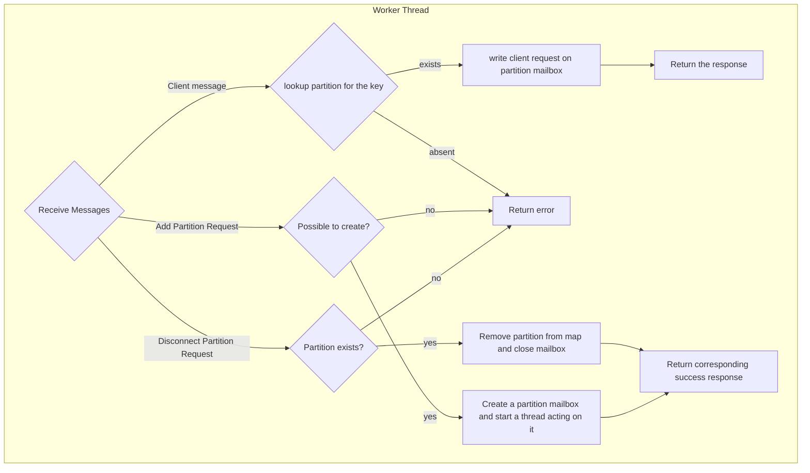
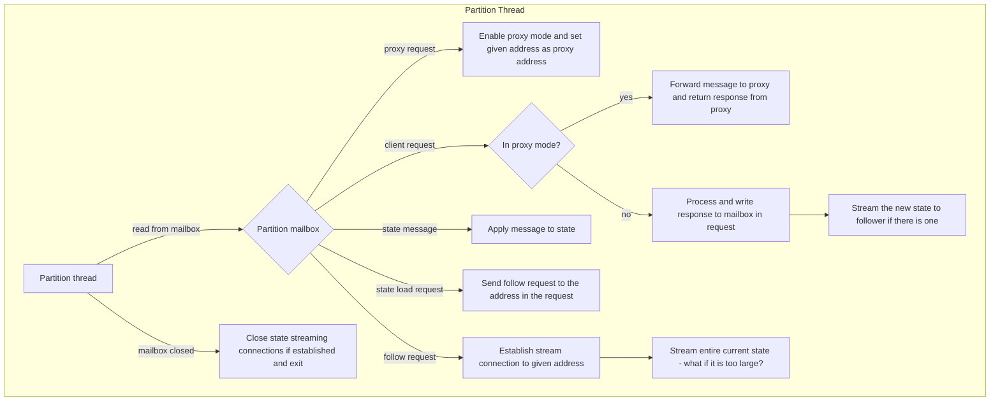

```mermaid
graph TD
    subgraph Worker Thread
    MSG{Receive Messages} --> |Client message| check{lookup partition for the key}
    check --> |exists| write[write client request on partition mailbox]
    write --> ret[Return the response]
    check --> |absent| err[Return error]
    MSG --> |Add Partition Request| checkp{Possible to create?}
    checkp --> |yes| addp[Create a partition mailbox and start a thread acting on it]
    checkp --> |no| err
    MSG --> |Disconnect Partition Request| checkdel{Partition exists?}
    checkdel --> |yes| delp[Remove partition from map and close mailbox] 
    checkdel --> |no| err
    delp --> rets
    addp --> rets
    rets[Return corresponding success response]
    end
```

```mermaid
graph TD
    subgraph Partition Thread
    PT[Partition thread]
    PT --> |read from mailbox| WCL{Partition mailbox}
    PT --> |mailbox closed| MC[Close state streaming connections if established and exit]
    WCL --> |proxy request| EP[Enable proxy mode and set given address as proxy address]
    WCL --> |client request| PRX{In proxy mode?}
    PRX --> |yes| FWD[Forward message to proxy and return response from proxy]
    PRX --> |no| CR[Process and write response to mailbox in request]
    WCL --> |state message| ASR[Apply message to state]
    CR --> SS[Stream the new state to follower if there is one]
    WCL --> |state load request| SSR[Send follow request to the address in the request]
    WCL --> |follow request| SR[Establish stream connection to given address]
    SR --> ES[Stream entire current state - what if it is too large?]
    end
```

```mermaid
graph TD
    subgraph Partition Move DAG
    W[Start] --> CP[Create new destination Partition object]
    CP --> |on success| dstpod[Send add partition request to destination worker]
    dstpod --> |on success| statereq[Send a state load request to destination partition with source partition address]
    statereq --> |on state loaded - how to determine?| prxy[Send a proxy request to source partition to proxy to destination partition]
    prxy --> |after a while| delp[Delete source Partition object]
    delp --> |on success| dcnt[Send Disconnect Partition Request to source partition worker]
    dcnt --> |on success| CMP[Mark DAG as complete]
    end
```