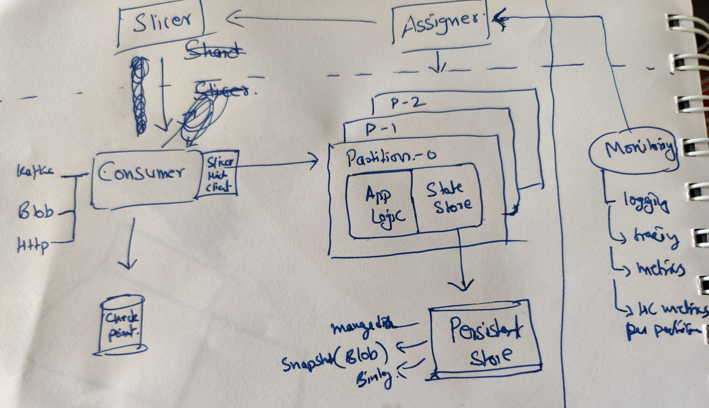

# Stateful Services

## Architecture

 
## Components

### Slicer
stores PartitionId -> PodId information. Control plane service. The 
slicer thick client embedded inside Consumer will sync the state from slicer.

### Assigner
Ensures that load is evenly balancer. Basis metrics emitted by 
various partitions, takes the decision to split, merge, migrate partitions.

### Monitoring
Since we are emitting metrics at a partition cut, traditional prometheus might
not work. need to support a cardinality of ~ 100K.

### Consumer
Responsible for ingesting data into the correct partition.
 
- Offline: It will read data from Kafka, blob ... Need to take care of
 checkpointing, retry, deferred flows.

- Online: Much thinner, mostly http client. In many cases embedded/collocated
(sidecar) with the main app

### Partition
Keyspace is divided into multiple partitions. Assume for now partition ~ 1GB
of data serving ~ 100 qps. Multiple such partitions are packed on a single pod
but logically they are independent. 
The App Logic receives the incoming messages, and it mutates the internal state
. It is equipped with a `durable` data structure called `State Store`. AppLogic
in 2 partitions do not communicate with each other.

### State Store
Multiple implementations supporting various features. Can be as simple as
Concurrent HashMap. This will work excellent in case of realtime counters
, but will not have features described below. For many cases, the default
 store MKV should suffice.
 
#### MKV
The default store will be an ssd optimized store based on badger
- [Rocksdb](https://github.com/facebook/rocksdb/) was the more popular option, 
but was ruled out due to c++ dependency which would complicate the build,
packaging, debugging experience. It has an excellent documentation of the 
internals and low level api which will be useful to understand the performance
characteristics of any LSM based data structure.

- [Badger](https://github.com/dgraph-io/badger)
is the data structure. seems reasonably popular with similar features and native
go implementation. It is feature rich with *good enough* performance. 
 
#### Api
Similar to TreeMap, things like
1. CRUD
1. Iterate (Reverse) from key
1. min, max, count ...

#### Features
1. Transactions

1. Durable: May employ remote/local ssd based iops requirements. Current iops
 number per TB
    - Local: 100K (L series with local NVM drives)
    - Remote: 5K (azure premium ssd)

1. Snapshot + bin log: This will require a remote blob store. 

1. Multi-tenant: Because partitions are small (1GB or smaller) and a single node
will have > 1K partitions. Opening 1K+ files with low qps will be fairly
inefficient. The hence the implementation will support multiple partitions
backed by share infra of ssd, files, os buffers ... There will be single
instance per ssd. 1 pod will only have a single ssd attached.
 