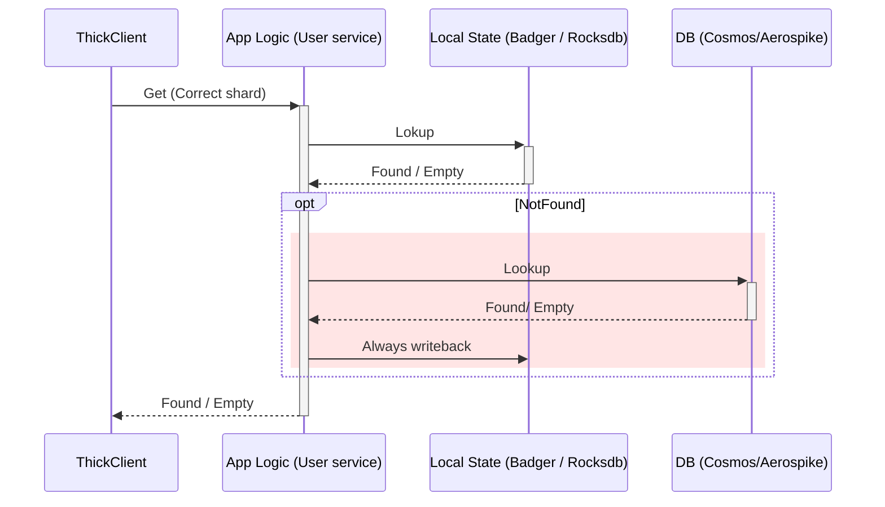

```mermaid
sequenceDiagram
    participant U as ThickClient
    participant S as App Logic (User service)
    participant G as Local State (Badger / Rocksdb)
    participant C as DB (Cosmos/Aerospike)

    U ->>+ S: Get (Correct shard)
    S   ->>+ G: Lokup
    G   -->>- S: Found / Empty
    opt NotFound
    rect rgba(255, 0, 0, .1)
        S   ->>+ C: Lookup
        C   -->>- S: Found/ Empty
        S   ->> G: Always writeback
    end
    end
    S   -->>- U: Found / Empty

```
