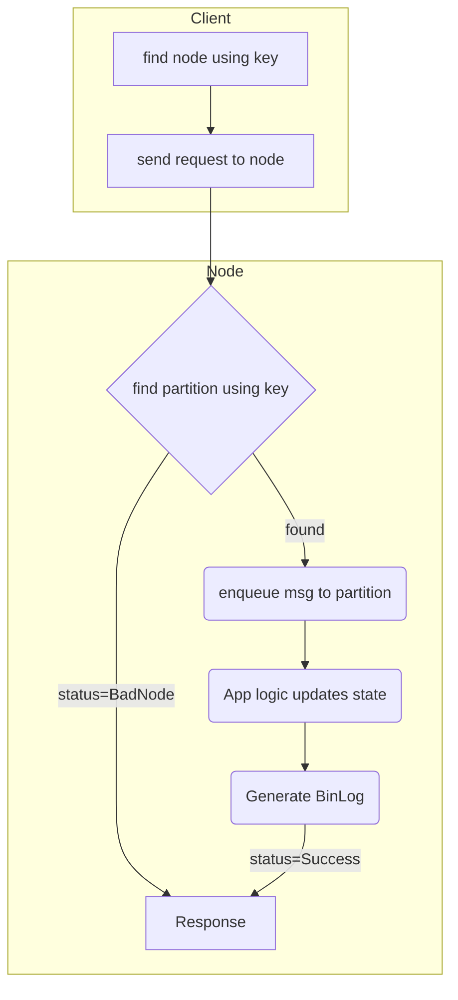

#Minimalistic Key Value Store

#Design:

Inline-style: 

## API
- DataPlane:
    - Upsert : Batch size upto 1MB
    - Get
    - Remove
- Control Plane:
    - AddPartition(id?, range)
    - RmPart(range/id ?)
    - ListPart
    - Snapshot(partition, local path) # sidecar uploads it to remote storage

They are exposed as 2 different grpc service because for control plane
- RateLimits are very low
- timeout is very high
- privileged operations

Service mesh will provide the above functionality

## Components

### Partition (id, range)
- Implements the data plane api in a single goroutine and synchronously. 
    - Significantly hurt performance for simple operations like kv
    lookup, spark shuffle due to context switching overheads. These
    operations are supported with atomic guarantees by the underlying
    datastructures. So thread jumping is simply wasteful.
    
    - Simplify guaranteeing [Linearizability](
    https://en.wikipedia.org/wiki/Linearizability) semantics even for simple
    things like stream join using read then write. Updating the record with non
    commutative operations.
    
    - Increase modularity for operations like binLog, raft.  
    
- Scale target is around 100 r/s. In case of managed disk, it may be lower.
- Snapshot operation is async

### PartitionRegistry
- Implement control api 
- Lifecycle of partition

### Router
- Uses the registry to route the traffic to correct channel

### Pipeline
Basic reusable components which `transform` the request. It can either be a
filter, enricher, sanitizer (remove sensitive fields). Most of them are not
mandatory. User can mix and match these. Eg: if ur using managed disk for
state store, then WAL and snapshotting may not be required.

Some useful items could be

1. Timestamp: a monotonic clock for this partition

1. WAL: need something for replay. Although the state store will also
contain a similar component, we will still keep it as an decoupled
component for providing flexibility in statestore implementations.
Something simple like mem-counters will not have WAL but it will need a
reliable backup restore mechanism. Possible implementations:
    
    1. Kafka: Extremely reliable and this solution can easily double as a
    flume collector.
    1. Managed Disk: Use a badger data structure and rely on durability

1. Replicate: choice of protocol like Two Phase Commit (2PC), raft, paxos.
For readonly use cases 2PC with multiple slaves might be a better fit. Even
for not so critical data like user history, we may choose something easy
like 2PC gaining automated recovery at the cost of some data loss or
corruption.

Some of these pipeline components are async as they do batching, rpc, diskio
. However they are still expected to maintain ordering of events. Else
framework will provide a components similar to the moving window in tcp
protocol to guarantee ordered flow of messages upstream.

### StateStore
Mostly defined and controlled by application but some OOB KV stores will
snapshot, restore features. 

Caching stores: apart from traditional use cases a local nvme can be used as 
write through cache for data persisted on a managed disk attached to the same vm
. Extra IOPS for this local cache will drastically help read heavy workloads. 
    

## Lifecycle of a request
You can render this diagram in vscode using 
https://marketplace.visualstudio.com/items?itemName=bierner.markdown-mermaid

    
## TODO:
- 
