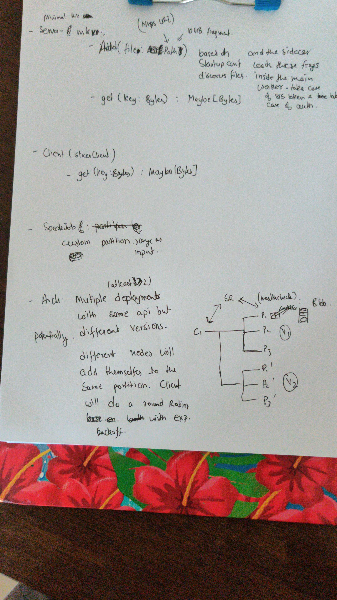
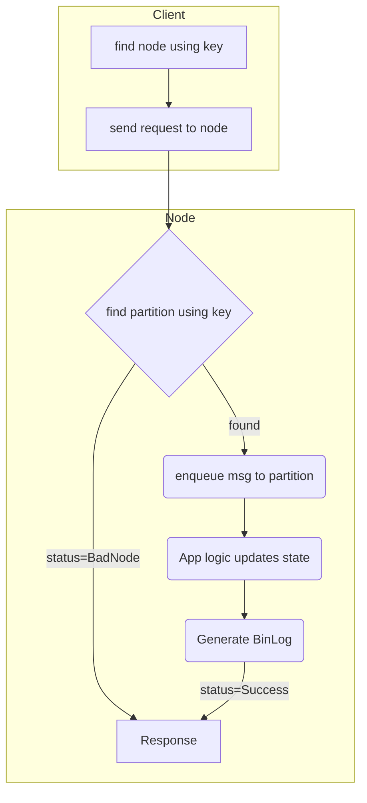

#Minimalistic Key Value Store

#Design:

Inline-style: 

## API
- DataPlane:
    - Upsert : Batch size upto 1MB
    - Get
    - Remove
- Control Plane:
    - AddPartition(id?, range)
    - RmPart(range/id ?)
    - ListPart
    - Snapshot(partition, local path) # sidecar uploads it to remote storage

They are exposed as 2 different grpc service because for control plane
- RateLimits are very low
- timeout is very high
- privileged operations

Service mesh will provide the above functionality

## Components

### Partition (id, range)
- Implements the data plane api in a single goroutine and synchronously. 
    - Significantly hurt performance for simple operations like kv
    lookup, spark shuffle due to context switching overheads. These
    operations are supported with atomic guarantees by the underlying
    datastructures. So thread jumping is simply wasteful.
    
    - Simplify guaranteeing [Linearizability](
    https://en.wikipedia.org/wiki/Linearizability) semantics even for simple
    things like stream join using read then write. Updating the record with non
    commutative operations.
    
    - Increase modularity for operations like binLog, raft.  
    
- Scale target is around 100 r/s. In case of managed disk, it may be lower.
- Snapshot operation is async

### PartitionRegistry
- Implement control api 
- Lifecycle of partition

### Router
- Uses the registry to route the traffic to correct channel

## Lifecycle of a request
You can render this diagram in vscode using 
https://marketplace.visualstudio.com/items?itemName=bierner.markdown-mermaid

    
## TODO:
- 
